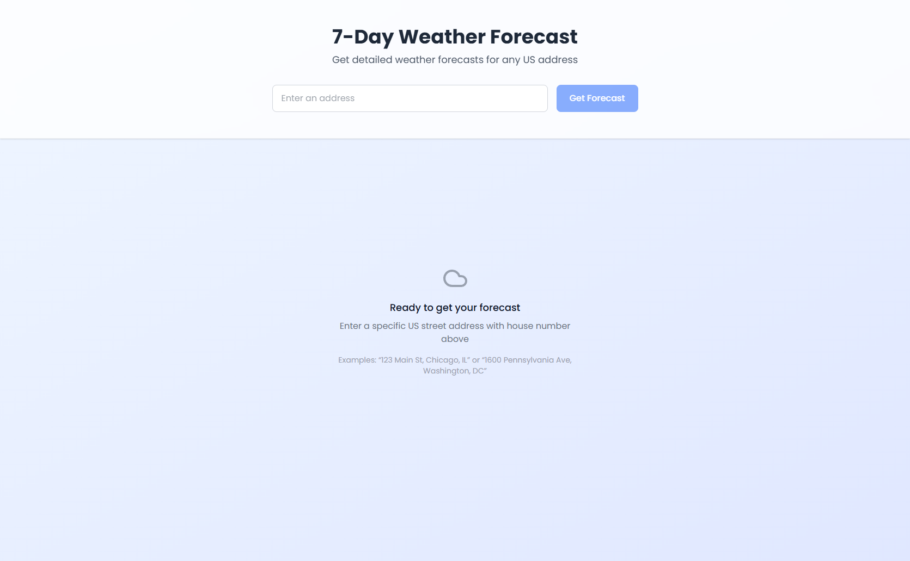
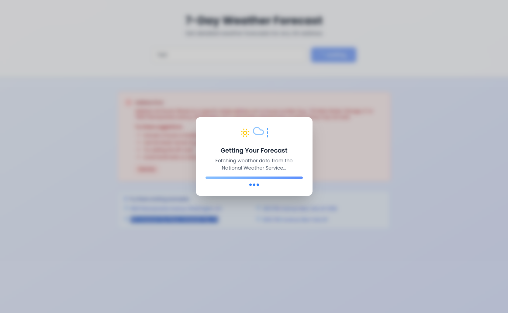
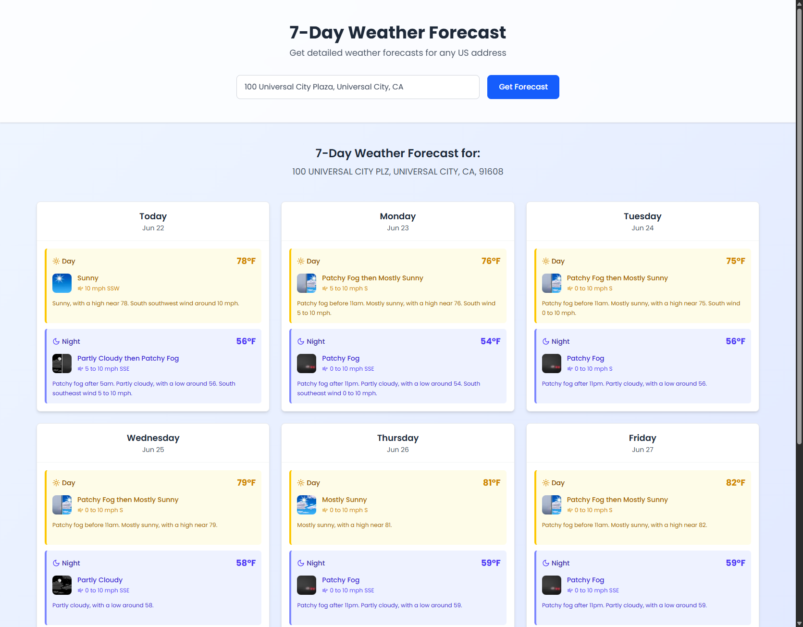
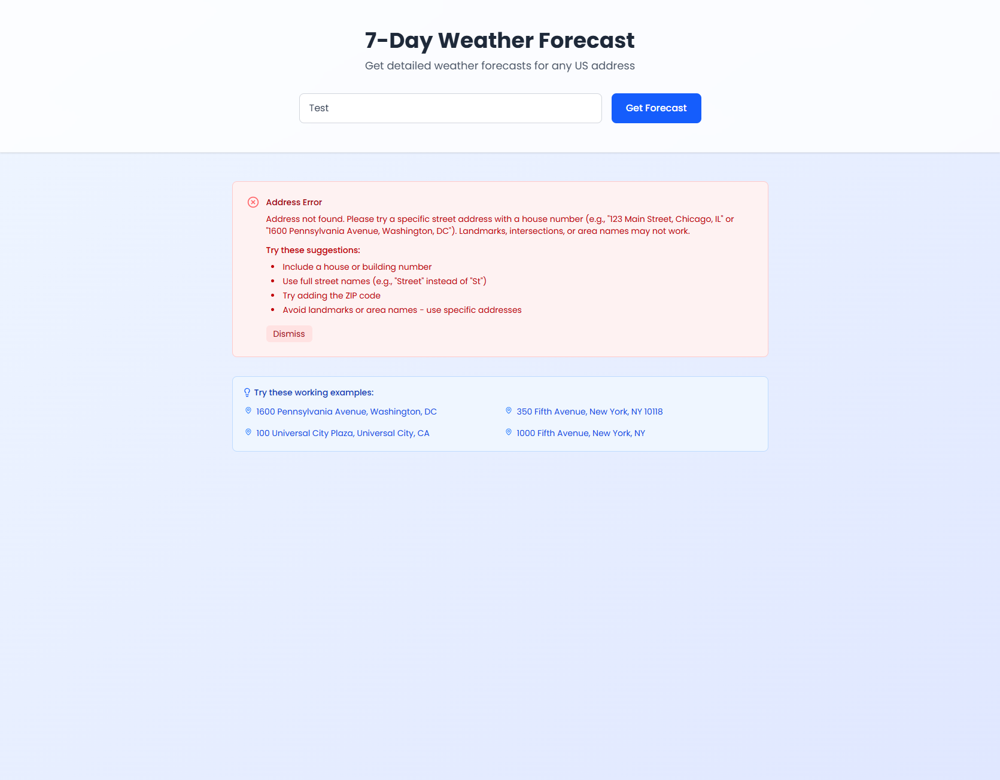
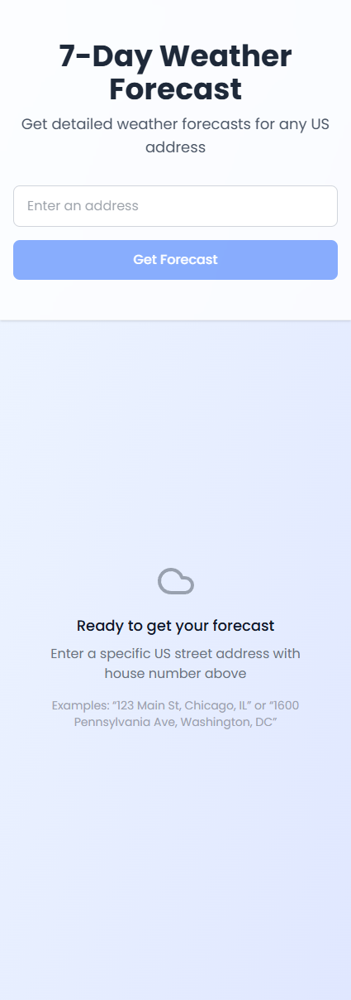
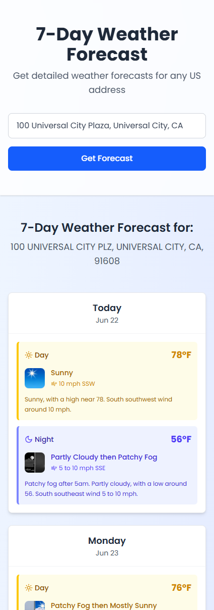
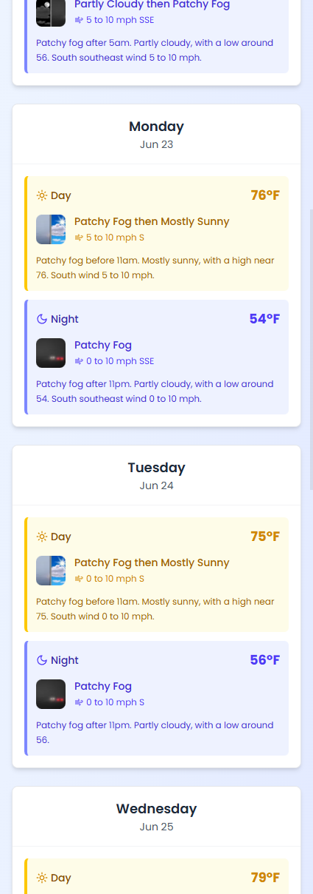
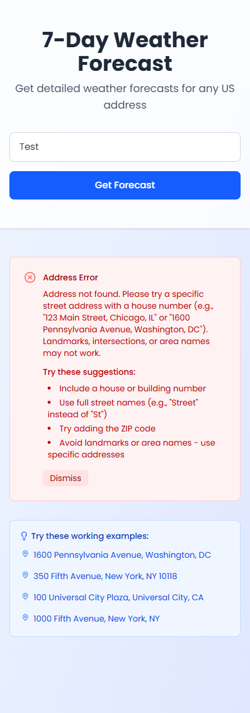

# 🌤️ 7-Day Weather Forecast

A modern, responsive weather forecast application built with Next.js that provides detailed 7-day weather forecasts for any US address. Features a clean, intuitive interface with day/night weather periods, comprehensive error handling, and a robust testing suite.


## ✨ Features

- **🏠 Address-Based Forecasts**: Enter any US address to get accurate weather predictions
- **📅 7-Day Coverage**: Complete week-ahead weather information
- **🌅 Day/Night Periods**: Separate forecasts for daytime and nighttime conditions
- **📱 Responsive Design**: Beautiful UI that works on desktop, tablet, and mobile
- **⚡ Real-time Data**: Powered by the National Weather Service API
- **🔄 Smart Error Handling**: Graceful error states with helpful suggestions
- **🎯 Working Examples**: Pre-loaded example addresses for quick testing
- **🧪 Comprehensive Testing**: 100% test coverage with Jest and React Testing Library

## 📸 Screenshots

## Desktop Screens

The app presents four main UI states on desktop:

| Initial State                                              | Loading State                                              |
| ---------------------------------------------------------- | ---------------------------------------------------------- |
|  |  |

| Forecast Display                                                | Error State                                            |
| --------------------------------------------------------------- | ------------------------------------------------------ |
|  |  |

---

## Mobile Screens

The mobile layout adapts to smaller screens while maintaining the same UI flow:

| Initial State                                             | Loading State                                             |
| --------------------------------------------------------- | --------------------------------------------------------- |
|  |  |

| Forecast 1                                                          | Forecast 2                                                          |
| ------------------------------------------------------------------- | ------------------------------------------------------------------- |
|  |  |

| Error State                                           |
| ----------------------------------------------------- |
|  |

## 🚀 Quick Start

### Prerequisites

- Node.js 18.0 or later
- npm or yarn package manager

### Installation

1. **Clone the repository**

   ```bash
   git clone <repository-url>
   cd 7day-forecast
   ```

2. **Install dependencies**

   ```bash
   npm install
   ```

3. **Start the development server**

   ```bash
   npm run dev
   ```

4. **Open your browser**
   Navigate to [http://localhost:3000](http://localhost:3000)

## 🛠️ Available Scripts

| Script                  | Description                             |
| ----------------------- | --------------------------------------- |
| `npm run dev`           | Start development server with Turbopack |
| `npm run build`         | Build the application for production    |
| `npm start`             | Start the production server             |
| `npm run lint`          | Run ESLint for code quality             |
| `npm test`              | Run the test suite                      |
| `npm run test:watch`    | Run tests in watch mode                 |
| `npm run test:coverage` | Generate test coverage report           |

## 🏗️ Architecture

### Project Structure

```
src/
├── app/                     # Next.js App Router
│   ├── api/forecast/        # Weather API endpoints
│   │   ├── route.ts         # HTTP request handling
│   │   ├── services.ts      # Business logic & external APIs
│   │   ├── utils.ts         # Data transformation utilities
│   │   └── __tests__/       # API tests
│   ├── globals.css          # Global styles
│   ├── layout.tsx           # Root layout component
│   └── page.tsx             # Home page component
├── components/              # Reusable UI components
│   ├── AddressForm.tsx      # Address input form
│   ├── WeatherCard.tsx      # Weather forecast display
│   ├── ErrorDisplay.tsx     # Error state handling
│   ├── EmptyState.tsx       # Initial empty state
│   ├── WeatherLoading.tsx   # Loading state
│   ├── WorkingExamples.tsx  # Example addresses
│   └── __tests__/           # Component tests
├── hooks/                   # Custom React hooks
│   ├── useForecast.ts       # Weather data management
│   └── __tests__/           # Hook tests
└── types/                   # TypeScript type definitions
    └── forecast.ts          # Weather data interfaces
```

### Key Components

#### 🎯 **API Layer** (`/api/forecast`)

- **route.ts**: Clean HTTP request/response handling
- **services.ts**: Business logic, geocoding, and weather API integration
- **utils.ts**: Data transformation and grouping utilities

#### 🎨 **UI Components**

- **WeatherCard**: Displays day/night weather periods with beautiful styling
- **AddressForm**: Handles user input with validation
- **EmptyState**: Displays a message when no forecast is available
- **ErrorDisplay**: Displays an error message when the forecast is not available
- **WeatherLoading**: Displays a loading state when the forecast is loading
- **WorkingExamples**: Displays example addresses for quick testing

#### 🔗 **Custom Hooks**

- **useForecast**: Manages weather data state, loading, and error handling

## 🌐 API Integration

The application integrates with two external APIs:

1. **Census Geocoding API**: Converts addresses to coordinates
2. **National Weather Service API**: Provides weather forecast data

### Error Handling

The app handles various error scenarios:

- Invalid or non-existent addresses
- Locations outside US coverage
- Network connectivity issues
- API service unavailability

## 🧪 Testing

### Test Coverage

The project maintains comprehensive test coverage:

- **Component Tests**: 57 tests covering all UI components
- **API Tests**: Integration tests for all service functions
- **Hook Tests**: Custom hook behavior and state management
- **Utility Tests**: Data transformation and edge cases

### Running Tests

```bash
# Run all tests
npm test

# Watch mode for development
npm run test:watch

# Generate coverage report
npm run test:coverage
```

## 🚀 Deployment

### Build for Production

```bash
npm run build
npm start
```

### Environment Requirements

- Node.js 18+ runtime
- No additional environment variables required
- Uses public APIs (no API keys needed)

## 📖 Acknowledgments

- **National Weather Service** for providing free, accurate weather data
- **US Census Bureau** for geocoding services

---

<div align="center">
  <p>Built using Next.js and TypeScript</p>
  <p>Weather data provided by the National Weather Service</p>
</div>
